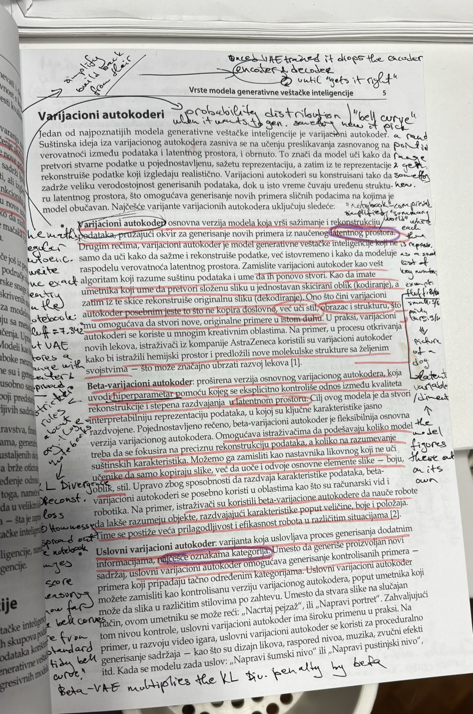

# Learning OS

> "The pyramid doesn't care how fast you climb it. It cares whether you actually built something on each level."

## Here's the story

One day I got tired of courses and YouTube University, walked into a bookstore, and got myself a good old-fashioned textbook.

I set up shop in a cafe, cute little pink pens in hand, and started reading and underlining... and using the friendly LLM apps I've got on my phone to explain things I didn't get (which was pretty much every other word).

Cut to page 5, two hours later, and my book's looking like this:



And those little purple circled words are what I asked my little bot to help me with, and this inspired me to build a command for myself in Claude Code to use while I'm reading the textbook -- that learning experience was so satisfying it got me building a whole bunch of these for all my MANY little side learning hobbies (including playing the drums -- ask me about that one if you dare, it actually "listens" to you as you play and tells you if you're off-beat).

Anyways... I was never a particularly good student. I was too anxious to just do stuff (or debating before I read the book) instead of "learning," which to me meant memorizing it by heart and forgetting it the day after the test -- so I guess I was a perfect student, actually, depending on if you're looking at grades and not retention.

So this time, I made myself my own little school with its own methodology and ways of staying accountable. This time the accountability wasn't connected to grades or what I've "learned" or which courses I took and finished, but what I've built.

The very last thing I added is the first database on that Notion page, called Master Project Pipeline -- this is where my mega projects, the reasons I got into all of this learning-AI business, live. They're the ones that require the most knowledge and effort (and probably decades of my life, but who's counting).

Hope someone finds this as useful and enjoyable as I do. See you on the other side. Or maybe somewhere in that rabbit hole of thought where the wiring that connects us all is stored, away from our data-compact day-to-day.

## The philosophy: a top-down pyramid built around immediate value

Most self-directed learning plans start at the bottom. Theory first, foundations first, "you need to understand X before you can touch Y." Forget that. You start where you can actually build something, then go deeper into the foundations once you actually need them, not before. Each layer just makes you better at the layer above it. You never stop being a builder, you just get more dangerous at it.

### The Four Layers

Every layer runs two tracks side by side. In my case that's AI Play (software, models, agents, automation) and Hardware Play (Arduino, then Raspberry Pi, then bridging the two). Steal the shape, swap in whatever tracks you're actually building across.

1. **Layer 1, Use & Build with AI.** Be a power user. Learn the tools, learn to talk to them, learn to string them together into something that actually works. No code required yet.
2. **Layer 2, Build Better.** Pick up just enough to build real things yourself. JSON, APIs, a little Python, SQL, GitHub, the terminal. Welcome to being a builder instead of just a user.
3. **Layer 3, Understand.** Now you want to know why it works, not just that it works. CS fundamentals, data engineering, architecture, what's actually happening inside the models you've been using this whole time.
4. **Layer 4, Root Knowledge.** The foundation everything else is standing on. Math, electrical engineering, the real model-level stuff. This is where builders start turning into scientists.

`/learning-os-setup` builds this out as a real "Master Learning Roadmap" page in your Notion workspace, not just a paragraph in a README. See the child-page section of [docs/NOTION_SCHEMA.md](docs/NOTION_SCHEMA.md) for the exact text it ships.

## The mechanism: a fully relational learning operating system

The six commands and the Notion workspace are what make the philosophy actually trackable instead of just a nice thing I believe. A place where "what have I actually learned, and where's the gap between what a lesson wants from me and what I've actually got" has a real answer instead of a vibe.

```
Learning Layer -> Course -> Lesson -> Skills (via Bridge) -> Practical Projects -> Learning Log
```

Layers are the big multi-month arcs. Courses and Textbooks live inside a Layer. Lessons live inside a Course. The Lesson-Skill Bridge is the secret weapon: required mastery vs. current mastery, so the gap is a number, not a feeling. Projects, software or hardware, and the daily Learning Log close the loop back to actual work. Nothing lives in a silo. And Master Project Pipeline sits above all of it, holding the actual reason I'm doing any of this.

See [docs/ARCHITECTURE.md](docs/ARCHITECTURE.md) for the full relationship map and [docs/NOTION_SCHEMA.md](docs/NOTION_SCHEMA.md) for every database's exact fields.

The six commands are how you touch this thing day-to-day. Each one remembers your last few sessions through NotebookLM, teaches you at whatever depth you've told it to, and pushes what you did into Notion so you end up with a real record instead of a pile of old chats you'll never reopen.

## Commands

| Command | What it does |
|---|---|
| `/learning-os-setup` | One-time setup. Builds your Notion workspace and writes local config |
| `/tutor` | AI/ML concept tutor, layered explanations (intuitive to technical to ceiling), from a textbook |
| `/coursetutor` | AI concept tutor with real code walkthroughs, plus a step-by-step project-build mode that ships to GitHub |
| `/mathtutor` | Math for ML, every concept grounded in a real system (Spotify, GPS, Netflix...) with symbolic math and 2D/3D visualizations |
| `/hardwaretutor` | Hands-on Arduino/Raspberry Pi mentor. Wiring photo review, code debugging, circuit simulation, build-along project mode |
| `/problemoftheday` | Adaptive daily problem-solving coach, levels 1-10, ML-engineering-biased problem selection |
| `code-explainer` (Skill, auto-triggers) | Explains existing code through inline teaching comments, a README with an analogy, and a Mermaid diagram |

## Prerequisites

- **Python 3.9+**, used by `scripts/setup_notion.py` and `scripts/notion_push.py` (stdlib only, nothing to pip install for those two)
- **A Notion account** and an [internal integration](https://www.notion.so/my-integrations), see [docs/SETUP.md](docs/SETUP.md)
- **[notebooklm-py](https://pypi.org/project/notebooklm-py/)**, install it then run `notebooklm login`
- **[GitHub CLI](https://cli.github.com/)** (`gh`) + `gh auth login`, only needed for `/hardwaretutor` or `/coursetutor`'s project-completion flow
- Per-command extras: `sympy`/`numpy`/`matplotlib`/`plotly` for `/mathtutor`; `arduino-cli`, `Schemdraw`, `PySpice`+`ngspice`, `PlatformIO` for `/hardwaretutor`; `graphviz` (optional) for `/problemoftheday`

## Setup

See [docs/SETUP.md](docs/SETUP.md) for the full walkthrough. Short version:

```bash
git clone <this-repo> ~/projects/learning-os
# add ~/projects/learning-os as a Claude Code plugin, or copy commands/ into ~/.claude/commands/
```

Then in Claude Code, run `/learning-os-setup` and follow the prompts. It builds the 14 Notion databases, the dashboard page (with the actual philosophy written into it, not just the schema), and the Master Learning Roadmap page in your own workspace via the Notion API. No manual "duplicate this template" step, no depending on someone else's shared page. Writes `~/.learning-os/config.env` when it's done.

## Personalizing

Every command reads an optional `$LEARNING_OS_USER_PROFILE_PATH` markdown file to calibrate depth and tone, see [config/USER_PROFILE.example.md](config/USER_PROFILE.example.md). Skip it and each command falls back to a sensible default profile.

## Known rough edges

- The Notion API deprecated `Notion-Version: 2022-06-28` (what this project pins to) as of a 2025-09-03 upgrade that introduced a `data_sources` layer. Still works for the single-data-source databases this setup creates, but Notion could sunset it eventually, see the header comment in `scripts/setup_notion.py` before upgrading.
- Databases are created inline (`is_inline: true`) so they render embedded in the dashboard page instead of as separate subpage links. If one shows up as a subpage instead, drag it inline manually in Notion. One-time fix.
- Master Project Pipeline ships with a `Scope` field (Dashboard Only / Learning OS Only / Both) that made sense in the original workspace this was extracted from, where the same database was shared across two systems. In this standalone template it's just a select field with no relation wired to anything outside Learning OS. Use it or ignore it.

## License

MIT, see [LICENSE](LICENSE).
